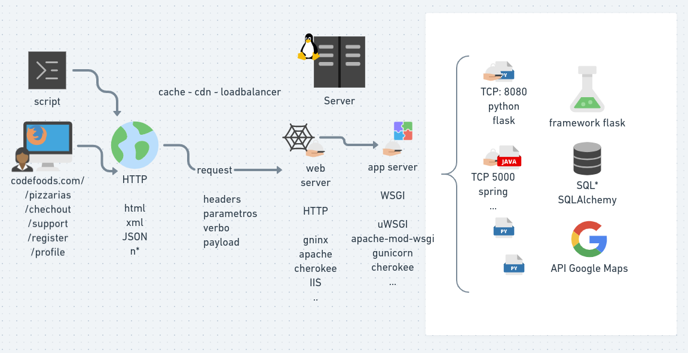

# curso-flask

Curso Flask - https://skip.gg/curso-flask-codeshow

Leia a [Apostila](/apostila).

## Aula 1

- Python
- Terminal
- Tipos de dados escalares
- Condicionais
- Repetições
- Erros
- Tipos de dados compostos

## Aula 2

- Funções
- Decorators
- Classes
- Módulos
- Visão geral do ambiente web

## Aula 3

- Métodos HTTP
- Códigos de Status HTTP
- Verbos HTTP
- Front-End(HTML/CSS/JS)
- Back-End(WSGI/Banco de dados) 
- Framework Flask

## Aula 4

- Arquitetura  de factories
- Contexto de configuração 
- Contexto de aplicação
- Contexto de request 